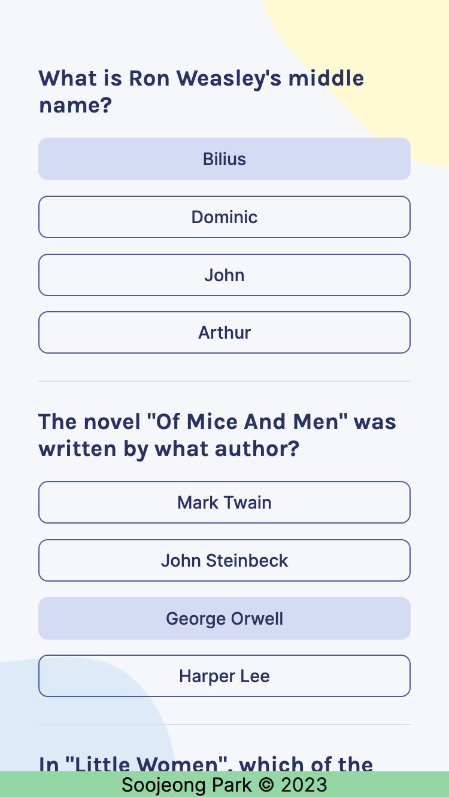
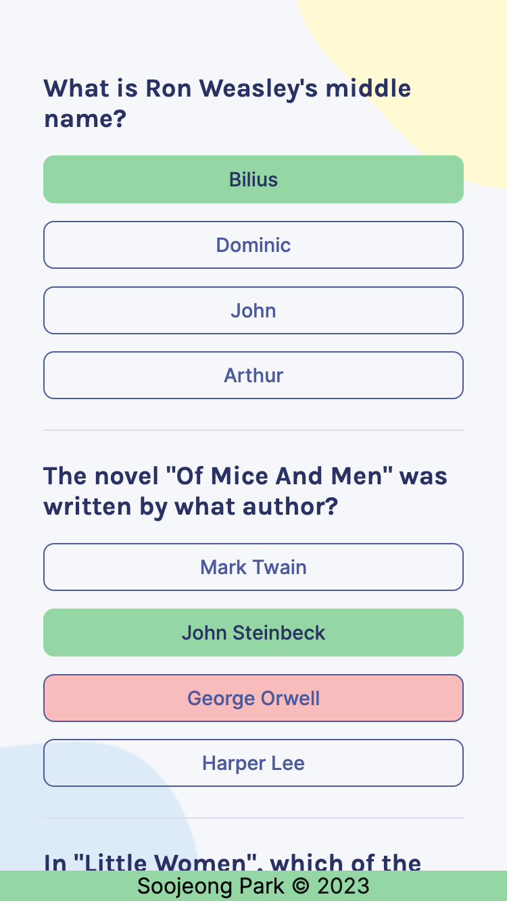
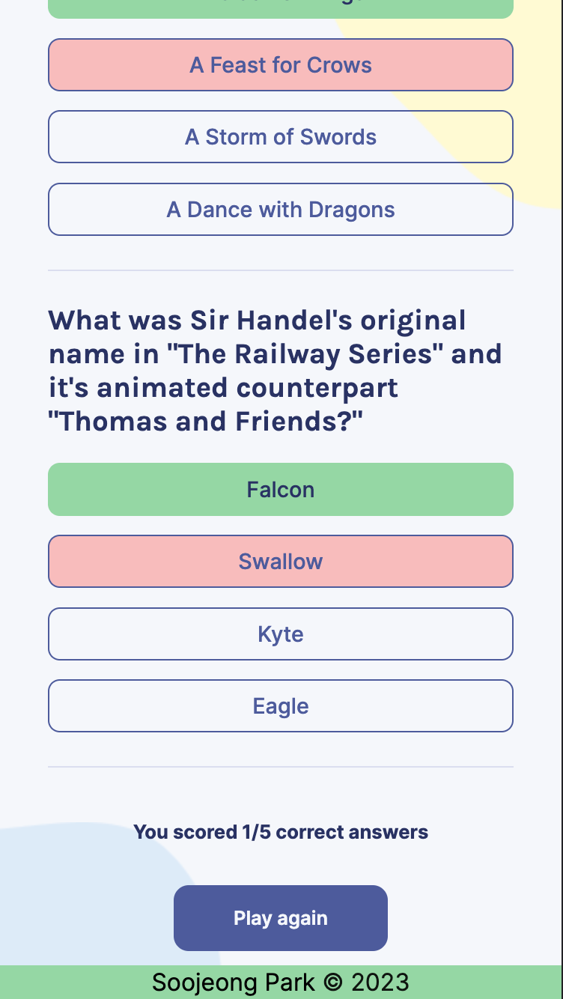

# Quizzical

A trivia app built with React.

## Table of contents

- [Overview](#overview)
  - [Screenshots](#screenshots)
  - [Demo Link](#demo-link)
- [About the Project](#about-the-project)
  - [Status](#status)
  - [Built with](#built-with)
  - [Reflection](#reflection)
- [Author](#author)

## Overview

### Screenshots

mobile version :

   

### Demo Link

**[💻 Live Site URL]()**

## About the Project

### Status

✅ Completed & Deployed

### Built with

- HTML
- CSS
- React
- Vite

### Reflection

This was a project built from scratch while taking Learn React course by Bob Ziroll on Scrimba. This app was built with the Figma design file provided by the course. The course did not provide guide or walkthrough for building the app.

I used the following features in the app :

- fetching Trivia API data from https://opentdb.com/api_config.php using useEffect
- using React useState hooks to work with state / data across the app
- using React useEffect hook to re-render components when relevant data changes
- using CSS classes to add / remove styles for quiz options when the options are clicked and answers are submitted

This was a fun and exciting app to create especially because I had to build everything from scratch. I learned a lot while I was creating multiple React components and using data across the components to make the app work. Working with props was the main way I accomplished moving data from one component to another.

One of the challenges I ran into was making the score system work. It required me to decide the logic for choosing and unchoosing the option from each question so that I could update the individual and overall score of the quiz depending on the choices a user might make.

The technologies implemented in this project are React, HTML, CSS, and React. I used Vite boilerplate to minimize initial setup.

## Author

Soojeong Park [@codingsooj](https://twitter.com/codingsooj)
